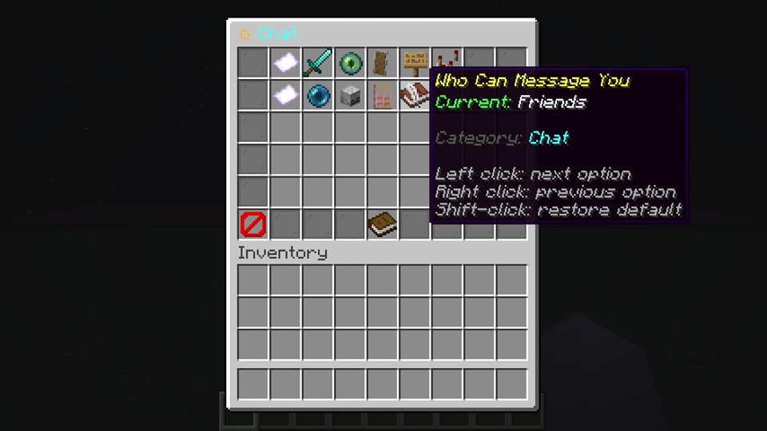
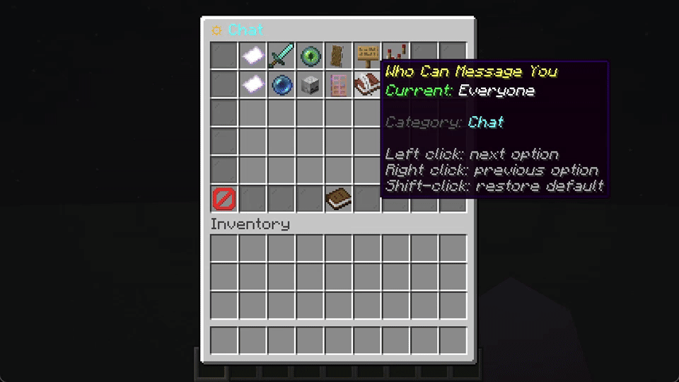

# BetterSettings

BetterSettings is an API-first player preferences menu for Paper servers. Version 1.1 adds reliable custom YAML loading, typed toggle and choice values, atomic reloads, and an opt-in DonutSMP-inspired tab layout.

## Requirements

- Java 21 or newer
- Paper 1.20.5 or newer

The 1.1.0 candidate has been loaded on Paper 1.20.5 with Java 21 and Paper 26.2 with Java 25. Folia is not advertised as supported because a Folia runtime journey has not been completed.

## Install

1. Build or obtain `BetterSettings-1.1.0.jar`.
2. Put the jar in the server's `plugins` directory.
3. Start the server once.
4. Use `/settings` in game.

The plugin never rewrites an existing configuration or player-data file during an upgrade. Newly bundled files are copied only when they are missing.

## Presets

Select a layout in `config.yml`:

```yaml
preset:
  active: classic # classic or donutsmp
  hide-unavailable: false
```

`classic` keeps the existing category menu. `donutsmp` uses a 54-slot tabbed inventory with Chat, Notifications, PvP, Visuals, Privacy, Scoreboard, and General tabs. It is inspired by the organization of a public DonutSMP settings walkthrough; it does not copy the pause-screen interface or claim DonutSMP features.

Provider-dependent entries such as auction alerts, payment policy, item-worth lore, scoreboard lines, rank display, and fast crystals stay hidden until another plugin registers their behavior. Empty tabs are hidden as well.

Controls:

- Left click toggles a setting or advances a choice.
- Right click moves to the previous choice.
- Shift-click restores the configured default.

## Preview





The choice control shown in the capture media is a custom definition used to
demonstrate the public multi-choice API. It is not a bundled server feature.

## Reliable custom settings

Custom definitions are accepted in `settings.yml` and in `settings/*.yml` as:

- a legacy single setting at the file root;
- multiple named setting blocks; or
- a named block with an explicit `id`.

The customer-reported shape now works:

```yaml
Test:
  enabled: true
  default-state: true
  permission: null
  icon: ENDER_PEARL
  description: "&eToggle private messages"
  category: "&7Uncategorized"
  priority: 1
```

Unknown categories are shown under Uncategorized with a warning. Invalid materials use `PAPER` and are reported by validation. Duplicate IDs and invalid semantic definitions reject the candidate registry instead of silently replacing a setting.

Reloads are atomic: `/settings reload` publishes a complete valid registry snapshot or keeps the current live snapshot. Settings and behaviors registered by other plugins survive YAML reloads.

See [CONFIGURATION.md](CONFIGURATION.md) for choices, actions, precedence, and validation behavior.

## Commands

| Command | Purpose | Permission |
| --- | --- | --- |
| `/settings` | Open the settings UI | `bettersettings.use` |
| `/settings reload` | Validate and atomically reload | `bettersettings.reload` |
| `/settings info` | Show preset and registry counts | `bettersettings.info` |
| `/settings validate` | Show validation counts and issues | `bettersettings.validate` |

The counts are derived from the loaded definition metadata and current capability providers. The documentation intentionally does not publish a fixed setting count.

## Developer API

The original `Setting`, `SettingsRegistry.registerSetting(...)`, boolean data methods, and boolean events remain available. Version 1.1 adds `ValueSetting`, `SettingType`, `SettingOption`, `SettingBehavior`, typed registration, string persistence methods, and `PlayerSettingValueChangeEvent`.

See [API.md](API.md) for examples and compatibility details.

## Build

```powershell
$env:JAVA_HOME = 'C:\path\to\jdk-21'
mvn clean package
```

Maven fails early with a clear message when it is run on Java older than 21. The candidate artifact is written to `target/BetterSettings-1.1.0.jar`.

## Verification status

Unit tests cover nested and multi-definition YAML, invalid definitions, duplicate IDs, atomic registry replacement, programmatic registration survival, preset merging, capability availability, old boolean data, choice persistence, invalid stored choices, and value cycling.

The isolated runtime evidence and remaining boundaries are recorded in [RUNTIME_EVIDENCE_1.1.md](RUNTIME_EVIDENCE_1.1.md). Paper 26.3 is treated as an experimental smoke target, not stable advertised support.
